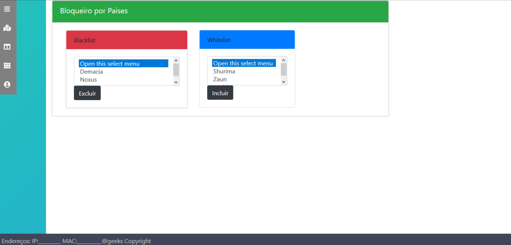

Descricao do pinfusor


## Versão 1.0


## Desenvolvido Por

> 
> `Banco de Dados` - [André Vitor Beraldo](https://github.com/AndreBeraldo) 
> 
> `Firewall` - 👻 [José Luiz Corrêa Junior](https://github.com/juninhoojl) 
> 
> `Frontend` - Halyson Vinícius Morais - <halysonmorais@get.inatel.br>
> 
> `Frontend` - [Felipe dos Santos](https://github.com/SecureHub)

## Hardware Necessário

**Observação:** Para reproduzir o que foi feito e desenvolvido por nós, basta um computador que possua pelo menos 2 interfaces de rede, porém, abaixo estão as especificações exatas do que foi usado!

* **1** Raspberry Pi 3 Model B
* **1** Cartão Micro Sd Ultra 32gb Classe10
* **1** Adaptador Lan Rede Gigabit Usb 3.0 Ethernet 10/100/1000
* **1** Cabo De Rede Ethernet 1m Metro Montado Rj45
* **1** Carregador De Tomada Usb Samsung 5.0v 2.0a
* **1** Cabo de dados usb com saída micro usb


## Sistema Operacional:

• [Raspbian Stretch Lite](https://www.raspberrypi.org/downloads/raspbian/) (Não possui gerenciador gráfico)

## Programas Auxiliares: 

[Etcher](https://etcher.io) (Para gravar .ISO no cartão SD de maneira fácil)

## 1 - Baixando o Sistema Operacional

[Nesse endereço] (https://www.raspberrypi.org/downloads/raspbian/), faça o download do Raspbian Stretch Lite, clicando em `Download ZIP`:


**Motivo da escolha do sistema operacional:**

O Raspbian é uma derivação do Debian, especifica para os computadores Raspberry®, logo, todo o hardware e sistema são totalmente compatíveis. Escolhemos a versão LITE, pois a interface gráfica não será necessária, e sendo assim, a utilização de recursos será melhor.


## 2 - Instalando o Sistema Operacional

Após ter o .zip, faça o download do software Etcher® [nesse endereço] (https://etcher.io), para facilitar a gravação da imagem no cartão SD, para instalar secione o .zip, selecione o drive e clique em `Flash!` (Esse processo pode demorar alguns minutos 👻)


## 3 - Habilitando o ssh
Após a instalação ter sido concluída, retire o cartão SD de seu computador e insira novamente, para ele ser montado, e então crie um arquivo com o nome “ssh” na raiz do drive de boot (Sem nenhum conteúdo dentro), isso fará com que o ssh esteja ativo na inicialização, portanto, não será necessário nenhum monitor para o procedimento. `É simples assim mesmo!!!`


## 4 - "Dando Partida!"

Após ter criado o arquivo do passo 3, ejete o drive, e o insira no Raspberry, ligando também a fonte de energia e o cabo ethernet. (Aguarde alguns segundos e o sistema operacional terá iniciado) 👌🏻


## 5 - Conectando por meio do ssh

Verifique o IP em que o o Raspberry se encontra e acesse um Terminal em seu computador, ou algum cliente ssh, e utilize o comando abaixo para acessar, utilize a senha padrão “raspberry”.(Lembre-se de substituir `xxx.xxx.xxx.xxx` pelo endereço que ele se encontra em sua rede)

```sh
ssh pi@xxx.xxx.xxx.xxx 

```
Pronto, você está logado em seu Raspberry agora!

**Dica:**
Uma maneira simples de descobrir qual endereço ele “pegou” a partir do DHCP de sua rede é utilizando o aplicativo [Fing](https://app.fing.io/login?backurl=https%3A%2F%2Fapp.fing.io%2Fapp), para dispositivos móveis, ou utilizando o comando `arp -a` no terminal, e note qual ip e mac se mostram novos, antes do boot dele.

## 6 - Criando SuperUser e Trocando  Senha Padrão

Para criar `SuperUser` digite o comando abaixo: 
(E então será solicitada uma nova senha UNIX, e sua confirmação 🔑)

```sh
sudo passwd 
```

*(Embora não será necessário, para logar como root digite: `su` e então será solicitada a senha, e para sair: `exit`)*

Por motivos de segurança iremos agora trocar a senha padrão, sendo está `raspberry`, pertencente ao usuário `pi`, sendo que a senha definida deverá ser usada para logar no futuro. Para isso, digite: 

```sh
sudo raspi-config
```

E então um menu com a opção de troca de senha aparecerá, como abaixo, e apenas siga as instuções:(Navege com as setas e a tecla `tab`) 


**Obs.:** Agora quando for se logar novamente pelo ssh utilize a nova senha definida por você!

## 7 - Atualize os Pacotes e Sistema

Estando logado no Raspberry, digite o comando abaixo para atualizar os pacotes:

```sh
sudo apt-get update

```
E em seguida o comando abaixo para buscar por atualizações:

```sh
sudo apt-get upgrade
```
Caso haja alguma atualização, confirme com `Y` e aguarde a instalação, logo após ter sido concluída, digite o comando abaixo para reiniciar o sistema (Será necessário logar novamente):

```sh
sudo reboot now
```

## 9 - Baixar os Programas Desenvolvidos por Nós

Primeiramente instale o GIT no seu computador com o seguinte comando:

```sh
sudo apt-get install git
```

Logo após instalar, faça uma cópia dos arquivos desenvolvidos por nós para o diretório DIY-Firewall na sua pasta de usuário, que será criado automaticamente, com os comandos:

Mas antes acesse o diretório de usuário: *❗️IMPORTANTE*

```sh
cd ~/
```
E nele execute o comando, que simplesmente fará um clone/copia:

```sh
sudo git clone LINKGIT DIY-Firewall

```


## 10 - Dando Todas as Permissões para execução

Com o comando abaixo será atribuída todas as possíveis permissões no diretório que contém todas as partes que são responsáveis por alterar regras, criar, deletar e afins.
*❗️(Obs.: Atente-se para ter certeza que o diretório se encontra na pasta de usuário, representada por `~`)*

```sh
sudo chmod -R 777 ~/DIY-Firewall
```

## 11 - Instalando servidor web Nginx

```sh
sudo apt-get install nginx
```

**Motivo de escolha desse web server:**
Considerando que o servidor web no nosso apenas irá servir para hospedar a interface de usuário, ou seja, muito poucas requisições serão feitas, e apenas um usuário por vez. E o desempenho x custo benefício (Consumo de recursos) do Nginx se destaca muito com pequeno volume de requisições.


## 12 - Instalar Ruby e Gem Necessária

Utilize o comando abaixo para instalar o interpretador da linguagem de programação Ruby:

```sh
sudo apt-get install ruby-full
```

Após instalar, instale também uma Gem que será necessária com o comando abaixo (Mais precisamente para converter endereços em IPS):

```sh
gem install ipaddress
```

**❓Por que ruby?**
Ruby foi escolhido para a maior parte dos programas/funções pois ela possui comandos complexos, que possibilitam fazer uma grande quantidade de coisas e operações com apenas uma linha simples ou uma pequena quantidade delas. Outra grande questão é a facilidade que a linguagem nos fornece para trabalhar com strings e caracteres, o que sem dúvida consiste em cerca de 50% das funcionalidades. Porém, foram usadas outras linguagens, como ShellScript e Python, de forma mais geral!


## 13 - Ajustes Antes de Configurar Rede Manualmente:

Antes de executar esse passo reinicie o sistema:

```sh
sudo reboot now
```
Depois de ter iniciado e logado, iremos para o `dhcpd` e retiralo da inicialização, pois utilizando esse recurso as configurações ficariam mais complexas. E faremos isso com os comandos abaixo:

Para parar:

```sh
sudo systemctl stop dhcpcd.service
```
E retirar da inicialização do sistema operacional:

```sh
sudo systemctl disable dhcpcd.service
```

## 14 - Instalar bridge-utils e ipset

O `bridge-utils` é uma ferramenta que permitirá criar e manusear bridges, e deve ser instalada a com do comando abaixo:

```sh
aptitude install bridge-utils
```

Instale também o Ipset por meio do comando abaixo, que permitirá o manuseio de uma grande quantidade de IPs e redes, por meio de hashes, de maneira mais eficiente: 💁🏻‍♀️

```sh
sudo apt-get install ipset

```

## 15 - Configurando Interfaces

🕵🏻‍♂️ Antes disso, será necessário que seja plugado o adaptador lan rede usb, após isso cheque qual o nome das interfaces de rede por meio do comando abaixo:

```sh
ifconfig
```

Desconsidere lo e wlan (caso exista), no nosso caso os nomes são `eth0` e `eth1`.


Agora vamos editar as configurações de rede, utilizando o editor nano, usando o comando abaixo:

```sh
sudo nano /etc/network/interfaces

```
E dentro dele, configure da seguinte forma:

```
source-directory /etc/network/interfaces.d

auto eth0
auto eth1

auto br0
iface br0 inet static
address 192.0.2.36
netmask 255.255.255.0
bridge_ports eth0 eth1
bridge_stp off
bridge_maxwait 0
bridge_fd 0
```
**Explicando arquivo:**

A primeira linha, que provavelmente já existirá, se tornou irrelevante, já que o dhcpcd.service foi desabilitado, então não é necessário remove-la.

Quanto aos `auto` servem para iniciar a interface mesmo que não esteja sendo utilizada, foi feito isso nas duas interfaces. *(eth0 - porta ethernet própria do Raspberry e eth1 - Criada com adaptador USB)*

**Obs.:** Configure o endereço e máscara de acordo com sua rede. (Obs, o ip estático nesse tipo de equipamento é útil, pois tendo anotado o valor, não será necessário ficar descobrindo)

**Finalmente:**

⌨️ Após edição do arquivo, saia e salve com as teclas ctrol + x e confirme salvamento e saída.

E então reinicie o sistema por meio do comando:

```sh
sudo reboot now

```


# Um pouco sobre o Frontend


## Ideia

O frontend é a parte do sistema responsável por realizar a comunicação com o usuário, isto é, receber uma entrada de dados, enviar ao sistema interno para processar(Backend) e então retornar ao usuário uma saída, no caso, retornar uma confirmação ao usuário. O frontend da Aplicação, neste caso, foi realizado via interface WEB, utilizando conceitos básicos de:

* HTML 
* CSS
* Javascript (Com framework Jquery)
* Bootstrap(4.0)

## O Que é Necessário para Modificar/Criar? 🤔
Não tem nada muito complexo em criar uma interface, é uma parte bem dinâmica que pode ser apenas funcional ou possuir alguns incrementos visuais e interativos de acordo com a vontade do usuário.


O frontend é a parte do sistema responsável por realizar a comunicação com o Observação: Para realizar o desenvolvimento do frontend, é necessário possuir:

* 1 Dispositivo (Computador, Celular e afins) que contenha algum editor de texto e um navegador WEB.
 
* Acesso à Internet.


## Programas utilizados
* [Sublime](https://www.sublimetext.com) - Editor de código usado por nós!
* [Atom] (https://atom.io) - Ótima alternativa

## 1 – Criando os documentos necessários
Crie os documentos necessários para começar o desenvolvimento conforme a imagem abaixo (Um arquivo `.css` e um arquivo `.html`) :


               
  **Obs.:** Ao criar um arquivo HTML pelo editor de texto sublime, o cabeçalho necessário para o desenvolvimento em HTML é gerado automaticamente, portanto não se preocupe xD. (Digite html e aperte `tab`)


## 2 - Um pouco sobre o Bootstrap

O Twitter Bootstrap é um framework para utilizar funções prontas de CSS e possui integração com o Jquery, outro framework utilizado para utilizar funções prontas de Javascript.
Utiliza-lo não exige conhecimento avançado. Após realizar a criação do documento necessário, é só pesquisar as funções desejadas e colocar no documento, uma boa criatividade pode ajudar a montar um frontend amigável.


## 3 – Utilizando o Bootstrap

Para utiliza-lo, caso não tenha seguido a página, basta fazer as seguintes coisas:

**1 -** Copie e cole o link de camada de estilo abaixo antes de todas as outras na sua tag `<head>`.

```html
<link rel="stylesheet" href="https://stackpath.bootstrapcdn.com/bootstrap/4.1.3/css/bootstrap.min.css" integrity="sha384-MCw98/SFnGE8fJT3GXwEOngsV7Zt27NXFoaoApmYm81iuXoPkFOJwJ8ERdknLPMO" crossorigin="anonymous">

```

**2 -** Faça a mesma coisa com esses src de js, dentro da <head> também!

```html
<script src="https://code.jquery.com/jquery-3.3.1.slim.min.js" integrity="sha384-q8i/X+965DzO0rT7abK41JStQIAqVgRVzpbzo5smXKp4YfRvH+8abtTE1Pi6jizo" crossorigin="anonymous"></script>
<script src="https://cdnjs.cloudflare.com/ajax/libs/popper.js/1.14.3/umd/popper.min.js" integrity="sha384-ZMP7rVo3mIykV+2+9J3UJ46jBk0WLaUAdn689aCwoqbBJiSnjAK/l8WvCWPIPm49" crossorigin="anonymous"></script>
<script src="https://stackpath.bootstrapcdn.com/bootstrap/4.1.3/js/bootstrap.min.js" integrity="sha384-ChfqqxuZUCnJSK3+MXmPNIyE6ZbWh2IMqE241rYiqJxyMiZ6OW/JmZQ5stwEULTy" crossorigin="anonymous"></script>
```

Caso queira maio detalhamento, acesse a página do framework [Twitter Bootstrap](https://getbootstrap.com) e clique em `Get Started`, como mostrado abaixo!


## 4 - Finalmente! 😤

Agora o documento já está pronto para receber as funções desejadas, caso queira colocar um menu, acesse a documentação do Bootstrap e cole os conteúdos dentro dos documentos .HTML e .CSS.
A interface criada foi elaborada pensando apenas em funcionalidade, portanto é bem simples.

## 5 - Resultados

O Após a criação dos documentos e algumas horas na frente do computador, uma interface parecida com a seguinte pode ser criada:


